# BlueSky-Ransomware-Investigation
Investigation of a BlueSky ransomware attack using Wireshark, Windows Event Viewer, PowerShell and VirusTotal.

# BlueSky Ransomware Investigation

## Overview

In this investigation, I analysed a BlueSky ransomware attack using a PCAP file and Windows Event Logs provided by CyberDefenders.

I followed the attack from the initial network activity through the MSSQL compromise, PowerShell execution, privilege escalation, defense evasion, persistence, credential dumping, lateral movement and finally the ransomware deployment.

Throughout the investigation, I correlated network traffic with Windows events and PowerShell activity to understand how the attack progressed.

## Tools Used

- Wireshark
- Windows Event Viewer
- PowerShell
- VirusTotal

## Investigation
### Q1 — Identifying the Source IP

> Knowing the source IP of the attack allows security teams to respond to potential threats quickly. Can you identify the source IP responsible for potential port scanning activity?

I started by opening the PCAP file in Wireshark and filtering for TCP SYN packets:

`tcp.flags.syn == 1 && tcp.flags.ack == 0`

The results showed `87.96.21.84` repeatedly sending SYN requests to `87.96.21.81` across multiple destination ports. This pattern identified `87.96.21.84` as the source of the port scanning activity.

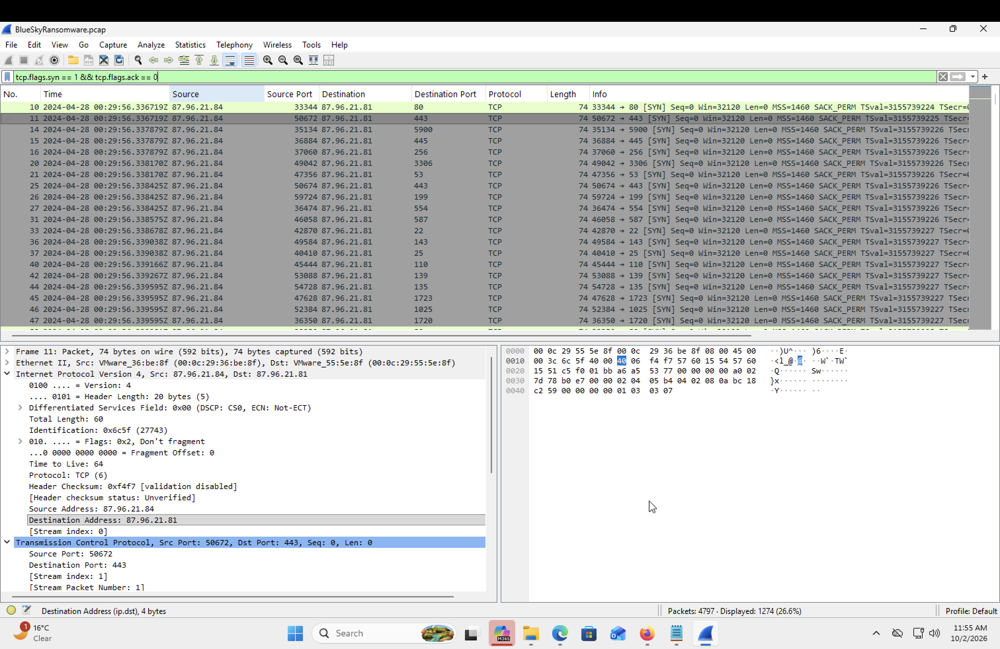

**Finding:** `87.96.21.84`

### Q2 — Identifying the Targeted Account

> During the investigation, it's essential to determine the account targeted by the attacker. Can you identify the targeted account username?

After identifying `87.96.21.84` as the source of the scanning activity, I moved to Windows Event Viewer to see if the same IP appeared in the host logs.

I searched for `87.96.21.84` and found an MSSQLSERVER Event ID `18456`. The event showed a failed SQL Server login from the same IP, with the username `sa` and the reason stating that the password did not match.

This connected the network activity I saw in Wireshark with the authentication activity on the SQL Server.

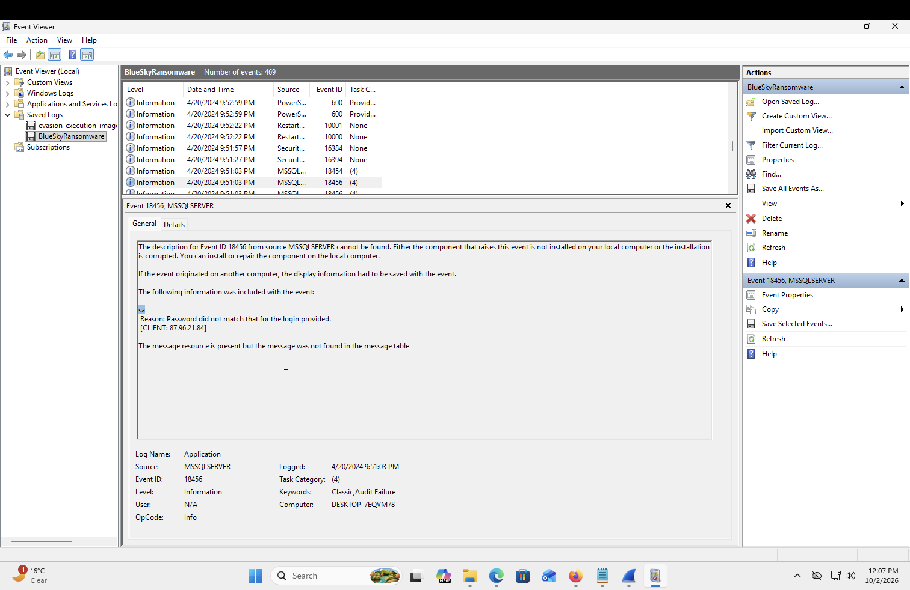

**Finding:** `sa`
### Q3 — Confirming Successful Access

> We need to determine if the attacker succeeded in gaining access. Can you provide the correct password discovered by the attacker?

After seeing the failed login attempts against the `sa` account, I went back to the PCAP to check the SQL login traffic.

I filtered for TDS login packets using:

`tds.type == 0x10`

Looking at the TDS7 Login Packet showed the `sa` account authenticating to `87.96.21.81`, along with the password used for the login.

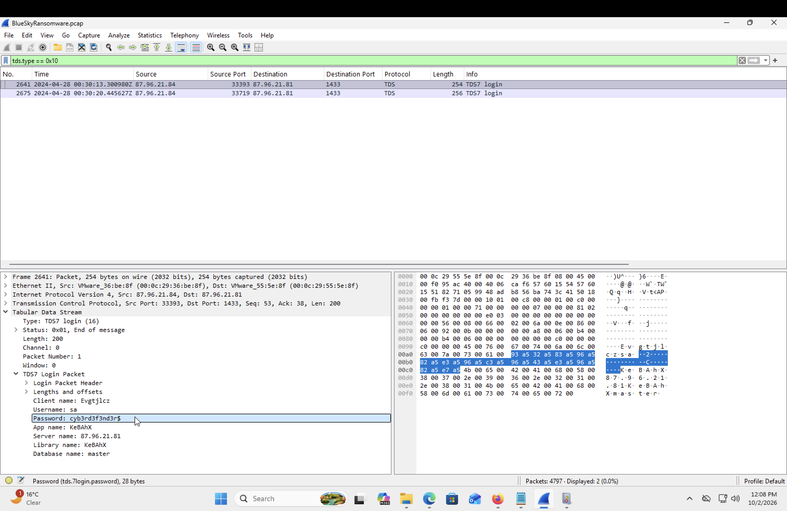

**Finding:** `cyb3rd3f3nd3r$`
### Q4 — Enabling Command Execution

> Attackers often change some settings to facilitate lateral movement within a network. What setting did the attacker enable to control the target host further and execute further commands?

After confirming the SQL access, I followed the same traffic using **Follow TCP Stream** to see what the attacker did after logging in.

In the stream, I found commands being used to enable `xp_cmdshell`. The SQL Server response confirmed the change:

`Configuration option 'xp_cmdshell' changed from 0 to 1`

With `xp_cmdshell` enabled, commands could be executed on the Windows host through SQL Server.

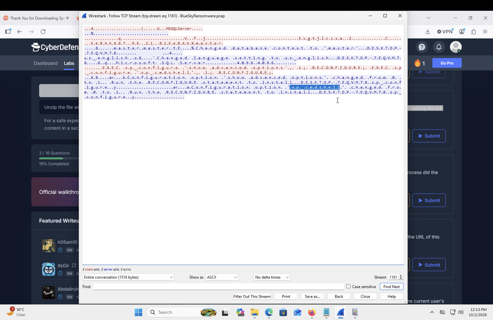

**Finding:** `xp_cmdshell`
### Q5 — Identifying the Process Used for C2 Injection

> Process injection is often used by attackers to escalate privileges within a system. What process did the attacker inject the C2 into to gain administrative privileges?

At this point, I moved back to the Windows Event Logs and searched through the PowerShell activity.

I found PowerShell Event ID `400`, where the event details showed `MSFConsole` as the host and `winlogon.exe` as the `HostApplication`.

This linked `winlogon.exe` to the attacker's C2 activity.

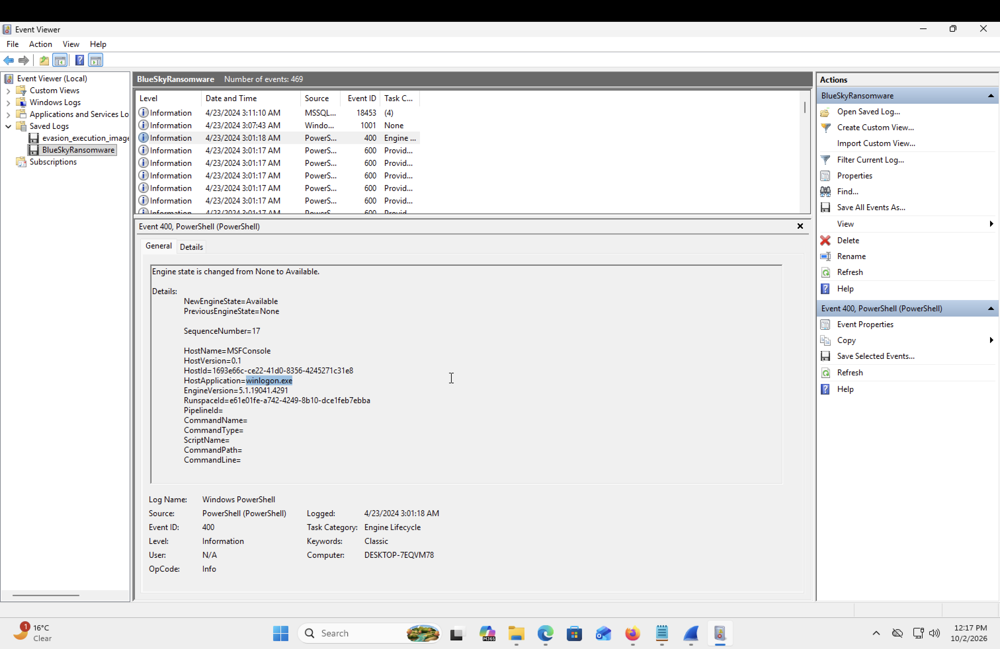

**Finding:** `winlogon.exe`
### Q6 — Identifying the Downloaded File

> Following privilege escalation, the attacker attempted to download a file. Can you identify the URL of this file downloaded?

I went back to the network traffic and filtered for HTTP requests:

`http.request`

Looking through the requests from the compromised host, I found a GET request to `87.96.21.84` for a PowerShell script called `checking.ps1`.

The full request URI was:

`http://87.96.21.84/checking.ps1`

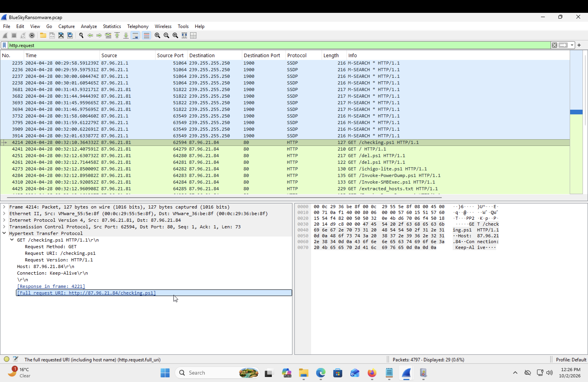

**Finding:** `http://87.96.21.84/checking.ps1`
### Q7 — Checking the User's Privileges

> Understanding which group Security Identifier (SID) the malicious script checks to verify the current user's privileges can provide insights into the attacker's intentions. Can you provide the specific Group SID that is being checked?

After finding `checking.ps1`, I followed the stream to look at what the script was actually doing.

Near the beginning of the script, I found a privilege check against the SID:

`S-1-5-32-544`

This SID belongs to the Windows built-in **Administrators** group, so the script was checking whether it was running with administrative privileges.

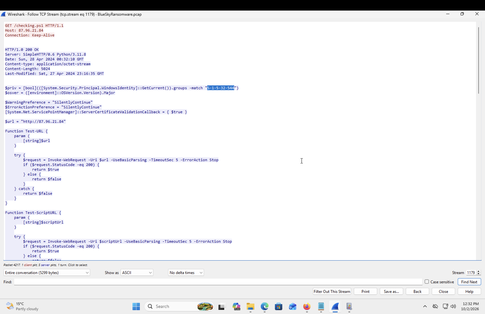

**Finding:** `S-1-5-32-544`
### Q8 — Disabling Windows Defender

> Windows Defender plays a critical role in defending against cyber threats. If an attacker disables it, the system becomes more vulnerable to further attacks. What are the registry keys used by the attacker to disable Windows Defender functionalities? Provide them in the same order found.

I continued reviewing `checking.ps1` and found a section specifically targeting Windows Defender.

The script modified several values under the Windows Defender registry path and also attempted to stop and disable the `WinDefend` service.

The registry values appeared in this order:

1. `DisableAntiSpyware`
2. `DisableRoutinelyTakingAction`
3. `DisableRealtimeMonitoring`
4. `SubmitSamplesConsent`
5. `SpynetReporting`

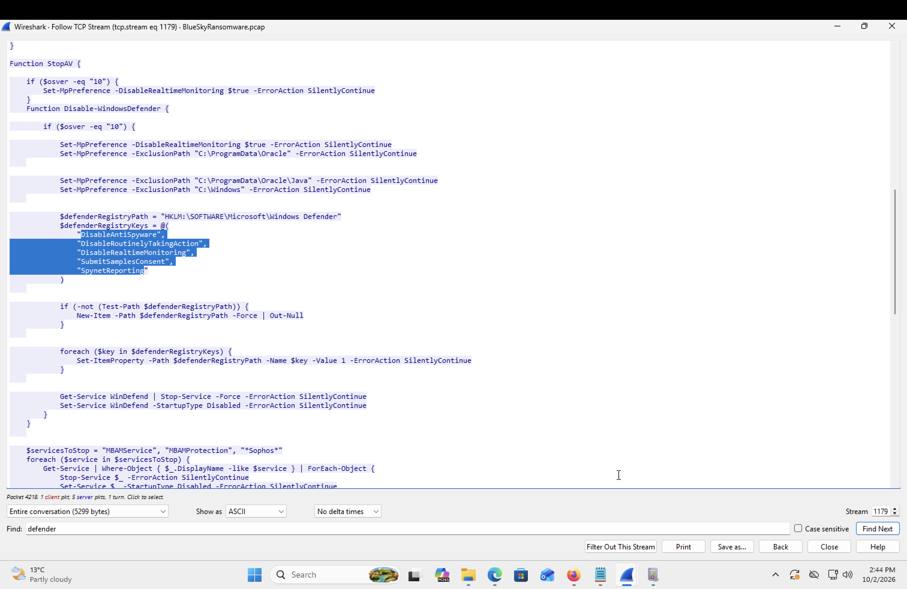

**Finding:** `DisableAntiSpyware, DisableRoutinelyTakingAction, DisableRealtimeMonitoring, SubmitSamplesConsent, SpynetReporting`
### Q9 — Identifying the Second Downloaded File

> Can you determine the URL of the second file downloaded by the attacker?

I went back to the HTTP requests in Wireshark and looked at the downloads in chronological order.

After `checking.ps1`, the next PowerShell file requested from the attacker's server was `del.ps1`.

The full URL was:

`http://87.96.21.84/del.ps1`

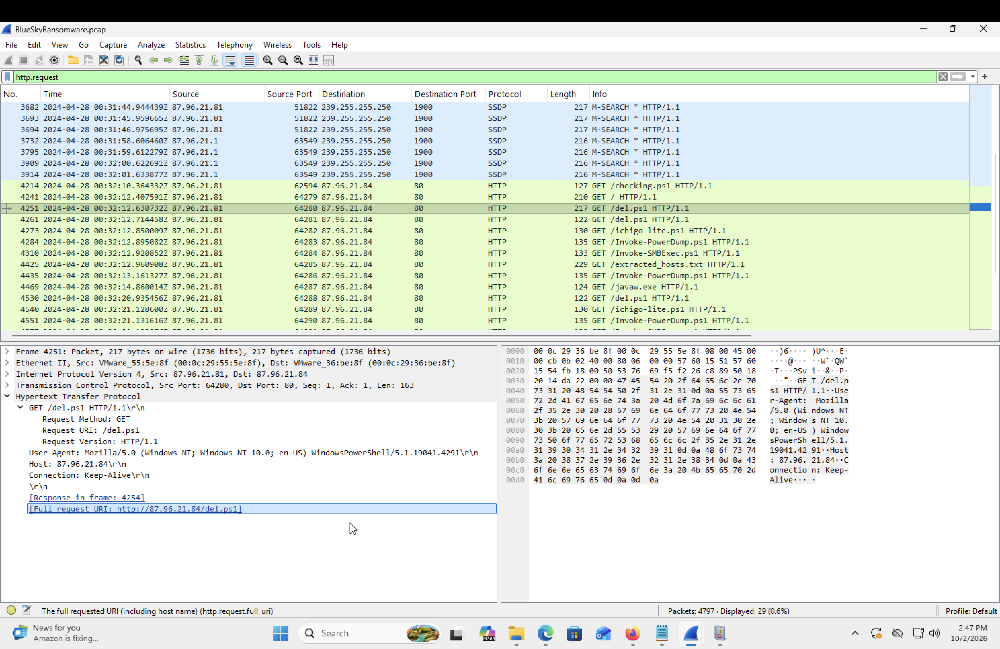

**Finding:** `http://87.96.21.84/del.ps1`
### Q10 — Establishing Persistence

> Identifying malicious tasks and understanding how they were used for persistence helps in fortifying defenses against future attacks. What's the full name of the task created by the attacker to maintain persistence?

Looking further into the script, I found that the attacker downloaded `del.ps1` to `C:\ProgramData\del.ps1` and then created a scheduled task to keep it running.

The task was created as `SYSTEM` and configured to run the PowerShell script every four hours.

The full task name was:

`\Microsoft\Windows\MUI\LPupdate`

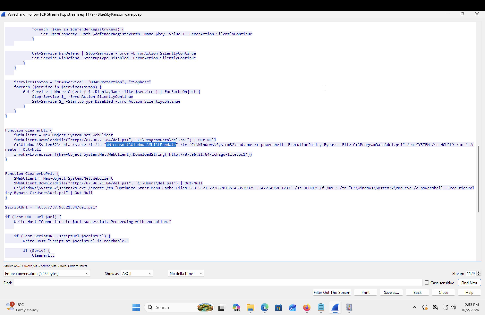

**Finding:** `\Microsoft\Windows\MUI\LPupdate`
### Q11 — Mapping the Activity to MITRE ATT&CK

> Based on your analysis of the second malicious file, What is the MITRE ID of the main tactic the second file tries to accomplish?

Looking at the behaviour of `del.ps1`, the main activity was focused on weakening the host's security controls.

The script modified Windows Defender settings, stopped the `WinDefend` service and also targeted other security products. This activity falls under the **Defense Evasion** tactic in MITRE ATT&CK.

The relevant evidence can be seen in the Defender activity shown in Q8.

**Finding:** Defense Evasion — `TA0005`
### Q12 — Identifying the Credential Dumping Script

> What's the invoked PowerShell script used by the attacker for dumping credentials?

Continuing through the HTTP traffic, I found another PowerShell script being pulled from the attacker's server:

`Invoke-PowerDump.ps1`

The script was used for credential dumping, allowing the attacker to obtain password hashes from the compromised system.

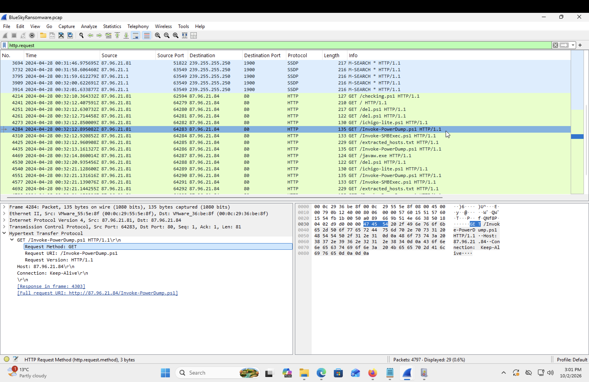

**Finding:** `Invoke-PowerDump.ps1`
### Q13 — Identifying the Credential Dump File

> Understanding which credentials have been compromised is essential for assessing the extent of the data breach. What's the name of the saved text file containing the dumped credentials?

After identifying `Invoke-PowerDump.ps1`, I wanted to see how the dumped credentials were being used later in the attack.

I filtered the HTTP traffic for:

`http contains "Invoke-PowerDump.ps1"`

This showed the related HTTP traffic, including the response containing `ichigo-lite.ps1`.

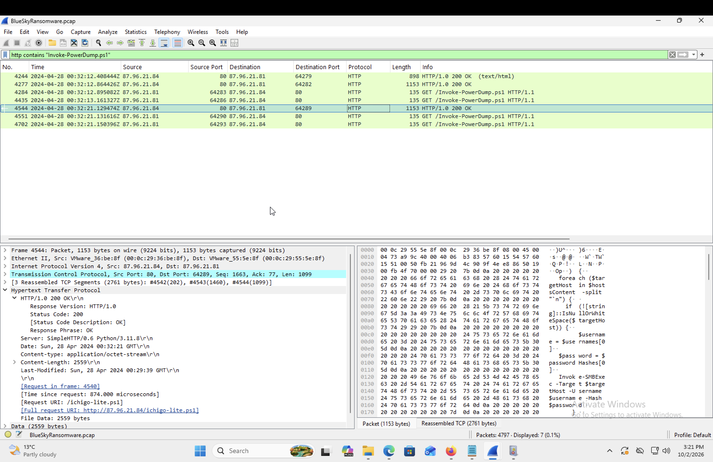

I followed the HTTP stream for `ichigo-lite.ps1` to inspect the script itself.

Inside the script, I found it loading `Invoke-PowerDump.ps1` and then reading credential data from:

`C:\ProgramData\hashes.txt`

The script stored the usernames and password hashes into separate arrays, which were later used against other discovered hosts.

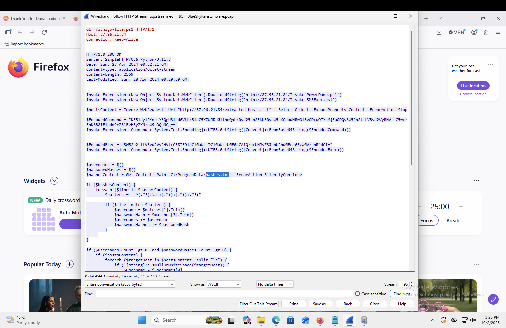

This confirmed that the dumped credentials had been saved in:

**Finding:** `hashes.txt`
### Q14 — Identifying the Discovered Hosts File

> Knowing the hosts targeted during the attacker's reconnaissance phase, the security team can prioritize their remediation efforts on these specific hosts. What's the name of the text file containing the discovered hosts?

While reviewing the same `ichigo-lite.ps1` script from the previous step, I noticed it was also pulling a text file from the attacker's server:

`http://87.96.21.84/extracted_hosts.txt`

The content was stored in the `$hostsContent` variable and later used by the script as a list of target hosts.

This showed that the file containing the discovered hosts was:

**Finding:** `extracted_hosts.txt`
### Q15 — Analysing the Ransomware Sample

> After hash dumping, the attacker attempted to deploy ransomware on the compromised host, spreading it to the rest of the network through previous lateral movement activities using SMB. You’re provided with the ransomware sample for further analysis. By performing behavioral analysis, what’s the name of the ransom note file?

After following the credential dumping and lateral movement activity, I went back to the PCAP to look at the files transferred during the attack.

In Wireshark, I used **File → Export Objects → HTTP**. Among the downloaded files, I found an executable called `javaw.exe` being transferred from `87.96.21.84`.

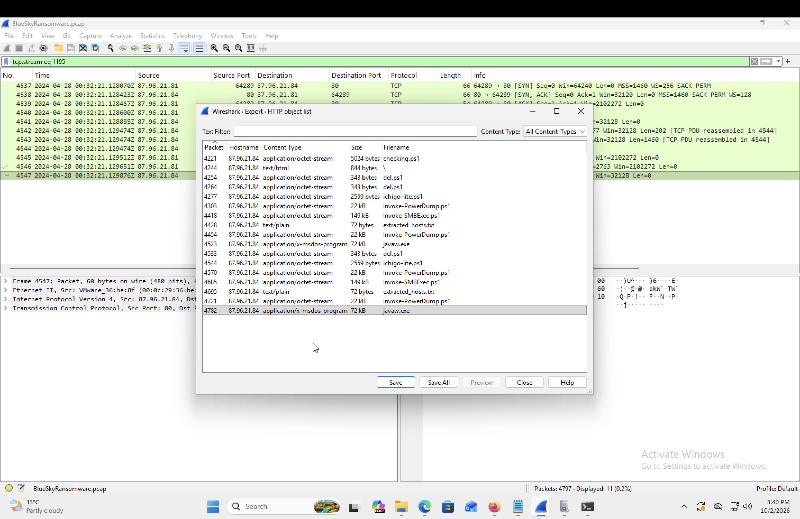

Rather than running the executable, I exported it and calculated its SHA-256 hash using PowerShell:

`Get-FileHash .\javaw.exe -Algorithm SHA256`

This gave me:

`3E035F2D7D30869CE53171EF5A0F761BFB9C14D94D9FE6DA385E20B8D96DC2FB`

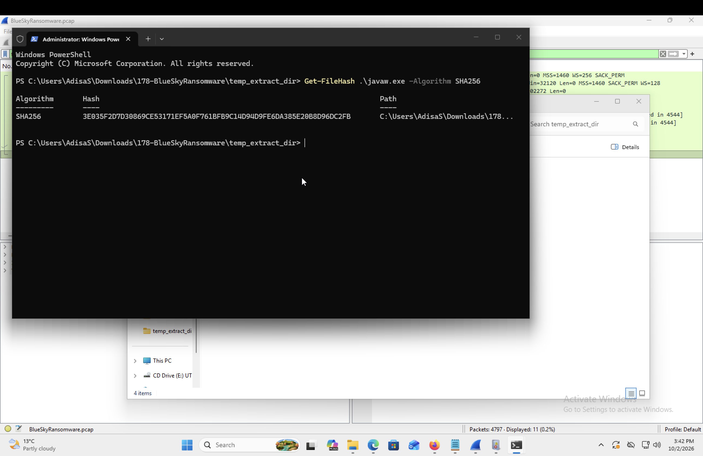

I searched the hash on VirusTotal and checked the **Behavior** results.

Under **Files Dropped**, I could see files being created with the `.bluesky` extension, along with the ransom note:

`# DECRYPT FILES BLUESKY #.txt`

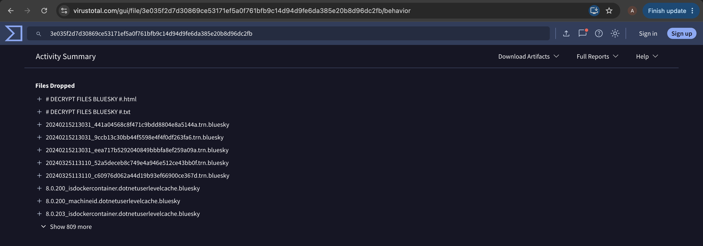

**Finding:** `# DECRYPT FILES BLUESKY #.txt`
## Q16 — Identifying the Ransomware Family

> In some cases, decryption tools are available for specific ransomware families. Identifying the family name can lead to a potential decryption solution. What's the name of this ransomware family?

After finding the ransom note, I went back to the VirusTotal detection results for the `javaw.exe` sample.

The sample was flagged as malicious by 63 out of 70 security vendors. More importantly, VirusTotal showed `bluesky` under the family labels, and some of the vendor detections also identified the sample as BlueSky ransomware.

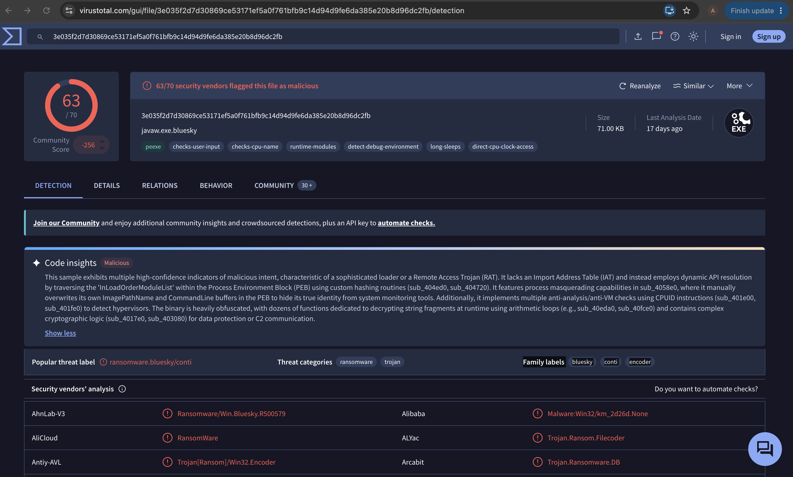

**Finding:** `BlueSky`
